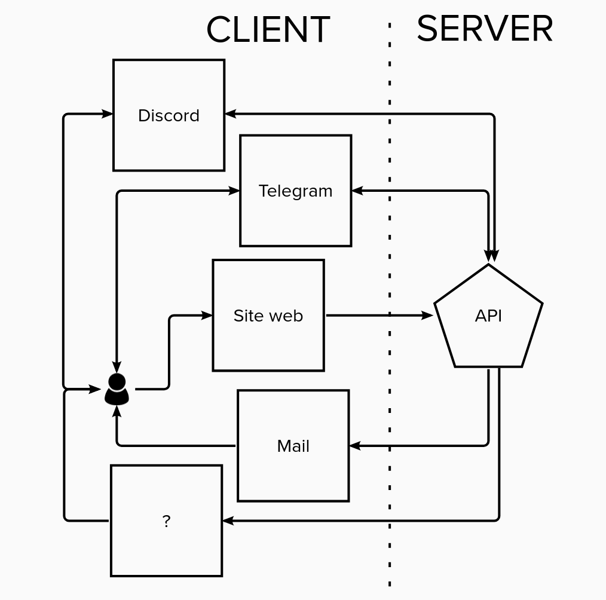

# Botonews

# Dans les grandes lignes

Le projet a pour but de développer une plateforme de distribution de news, 
de différentes sources sur différents supports, en fonction des préférences
de l'utilisateur.

Le projet est organisé en différentes étapes, permettant de faire évoluer le 
projet tout en réutilisant le travail fait pour les étapes précédentes. Le but 
final est d'avoir une application multi-tiers fonctionnelle.

# Terminologie

Ces termes peuvent avoir des significations différentes selon le contexte. Dans
ce projet, leurs significations sont les suivantes :

  - Par "*news*", il est sous-entendu différentes sources d'informations qui
    peuvent être obtenues via une API, un flux RSS, en scrapant des pages web,
    etc.
  - Par "*canaux*", il est sous-entendu les sources d'informations : site web,
    API, flux RSS, base de données, etc.
  - Par "*supports*", il est sous-entendu les différents moyens par lesquels les
    utilisateurs peuvent recevoir des informations : Telegram, Site Internet,
    Discord, mail, etc.

# Étape 1

Le but de la première étape est de se familiariser avec la récupération des 
données de différentes sources. Pour ce faire, réaliser un bot Telegram qui,
à la demande de l'utilisateur, récupère les news en provenance des différents
canaux, les met en formes puis les envoies au demandeur. Il y a des multitudes
de canaux possbiles, en voici quelques-uns que le bot pourrait proposer :

  - Les derniers liens raccourcis sur https://go.epfl.ch (via
https://go.epfl.ch/feed ou https://go.epfl.ch/apo)
  - Les dernières news EPFL (via l'API REST https://actu.epfl.ch/api-docs/)
  - Les dernières Hacker News (https://news.ycombinator.com/)
  - Les derniers messages Twitter de https://twitter.com/neckbeardhacker,  
    https://twitter.com/HipsterHacker et https://twitter.com/php_ceo

En plus d'apprendre l'utilisation de l'API de Telegram, cette étape permet aussi
de se poser la question de la gestion des secrets (par exemple la clé d'API
de Twitter ou celle du bot Telegram) et de prendre le recul pour développer
des modules réutilisables facilement dans les prochaines étapes. Il est aussi
nécessaire de se demander comment formatter les news pour que données des
différentes sources soient affichées de manière uniforme et homogène.

# Étape 2

Le but de cette étape est de réutiliser le code de l'étape
1 pour présenter les différentes news dans une page web.
L'utilisation de [masonry](https://masonry.desandro.com/) ou de
[bootstrap](https://getbootstrap.com/docs/5.0/examples/masonry/) est conseillée
pour présenter les news sous forme de mosaic de cartes. Cela permet d'acquérir
ou de réviser les compétences HTML/CSS/JS + langage côté serveur. 

Le site doit offrir la possibilité de choisir :
  - Quels canaux on souhaite afficher (par défaut tous)
  - Combien de news par canaux afficher (par défaut 5)
  - Comme trier l'affichage (par canal, par date des news, mélangé (random))

C'est aussi l'occasion de voir comment faire cohabiter le bot de l'étape 1
et les informations de la page web et de discuter de la mise en place d'une
éventuelle API pour le projet, qui fournirait les informations au bot et au site
web.

# Étape 3

Cette étape ajoute la notion de compte (et de préférences) des utilisateurs.

Cette évolution du site doit permettre aux utilisateurs de s'inscrire et de
configurer leurs préférences. Un utilisateur doit pouvoir choisir quoi recevoir,
ou et quand. Par exemple, Alice veut recevoir les dernières nouvelles de l'EPFL
sur Telegram dès qu'elles sont disponibles et un résumé des derniers liens [go]
le vendredi à 16:00 par email. Bob souhaite recevoir les derniers tweets de ses
comptes préférés sur discord, chaque jour à 09:00. Charlie désire uniquement 
personnaliser sa "home page" sur le site avec les news qui l'intéressent.

## Proposition d'architecture

La proposition d'architecture est la suivante : créer le cerveau de
l'application sous forme d'API. Les différents clients (Telegram, site internet,
etc.) communiquent avec l'API pour définir les réglages de chaques utilisateurs.
L'API est capable d'envoyer des emails, des messages Telegram ou discord, et
retourne de manière uniforme les news des différents canaux.

Le schéma ci-dessus définit le site web comme seul éditeur des préférences des
utilisateurs dans l'API, mais il serait envisageable que les utilisateurs 
puissent aussi définir leurs préférences depuis Discord ou Telegram.

Il serait intéressant de garder en tête la notion de groupe, par exemple pour
ajouter les anniversaires : tout le monde dans un groupe reçoit l'info que c'est
l'anniversaire de X, sauf X.

# Étape 4

Cette dernière étape serait la cerise sur le gâteau : permettre aux utilisateurs
d'ajouter de nouvelles sources d'information qui seront ensuite validées avant
d'être rendues disponibles à tous les utilisateurs.

[go]: https://go.epfl.ch
